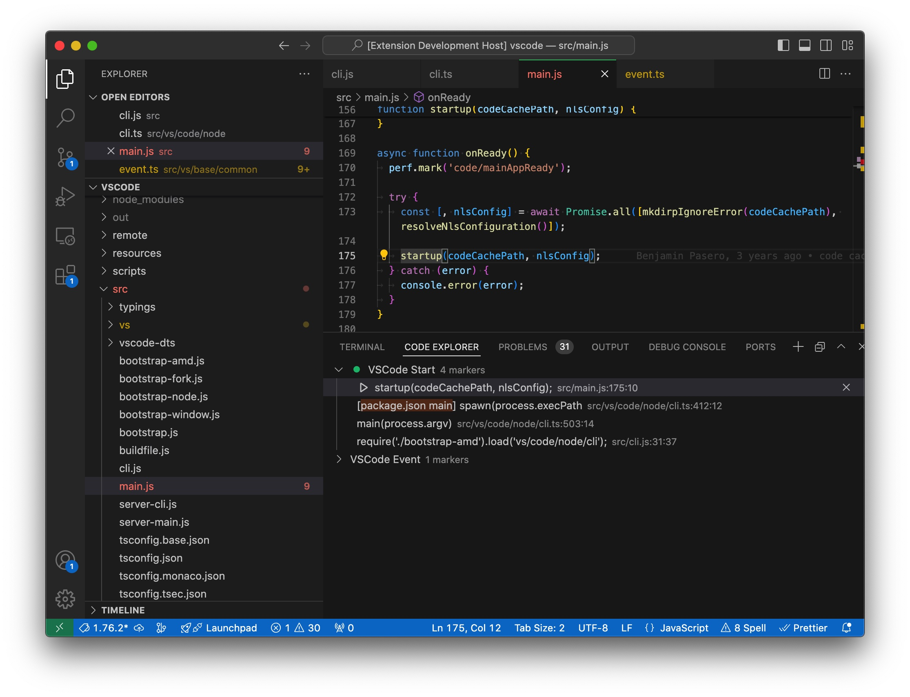

Code Explorer

> Mark code call chain like bookmark and more!

Explore codebase efficiently in VSCode with adding markers into a stack and switching among them.

## Features

- [x] Add markers for code of files.
- [x] Organize markers by stacks which is more like call stack.
- [x] Paste call stack (e.g. from VSCode debug CALL STACK view).
- [x] Indent/Unindent marker to make it like call hierarchy.
- [x] Drag and drop markers and stacks to re-order them.
- [x] Set title, colored icon, tags and reposition for a marker.
- [x] Copy markers as markdown into clipboard.
- [x] Show gutter icon for the line of marker.
- [x] Data is saved in workspace .vscode dir with JSON format.
- [x] Support multiple folder workspace.
- [ ] Support stack groups (group is also nested).
- [ ] Add default keyboard shortcuts tab/shift+tab to indent/unindent marker

> Tips: If you want to get a Call Stack style like debug view, which is showing function name as the marker title other than the code of marker's line, select from the marker line to function name line, then add code marker. Try it and see!

> **ATTENTION!**  
> If the files including markers are changed (like added/removed some lines), the position of markers would be kept originally! Thus it might mismatch your desired line. Keep it in mind.

## Usage

1. Install this extension. Download from [VSCode Market](https://marketplace.visualstudio.com/items?itemName=tianjianchn.code-explorer) or search `tianjianchn.code-explorer` in VSCode extension sidebar.
2. Open the `CODE EXPLORER` panel in VSCode bottom panels.
3. Open a source code file and select a statement, then run the command `Code Explorer: Add Code Marker`(or through context menu) to push a new marker into current stack.
4. Repeat last step when you are reading the code repo.
5. Click markers in the stack to switch back and forward.

Right click markers and stacks to get more actions.
