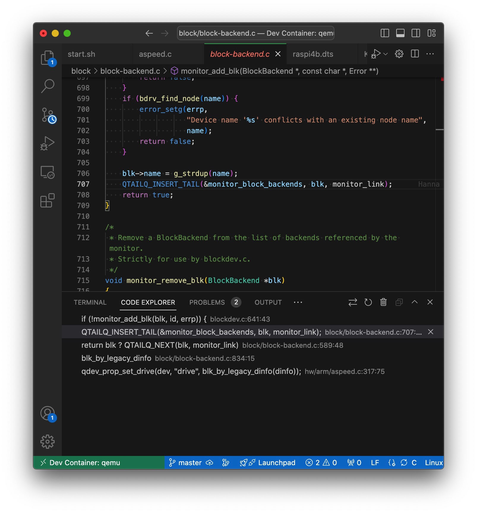

Code Explorer

> Mark code like bookmark and more!

Explore codebase efficiently in VSCode with adding markers into a stack and switching among them.

 

## Features

- Add markers for code of files.
- Organize markers by stacks which are more like code call chain.
- (TODO) Indent/Unindent markers to make it more like call hierarchy.
- Drag and drop markers order.
- Copy markers as markdown into clipboard.
- Data is saved in workspace .vscode dir with JSON format.
- Tag markers.

## Usage

1. Install this extension. Download from [VSCode Market](https://marketplace.visualstudio.com/items?itemName=tianjianchn.code-explorer) or search `tianjianchn.code-explorer` in VSCode extension sidebar.
2. Open the `CODE EXPLORER` panel(the current stack panel) in VSCode bottom panels.
3. Open a source code file and select a statement like function call, then run the command `Code Explorer: Add Code Marker` to push a new marker into current stack.
4. Repeat last step when you are reading the code.
5. Click markers in the stack to switch back and forward.

Code Explorer supports multiple stacks, you could switch another stack or create a new one. Try exploring the icons in the top-right bar of panel.
